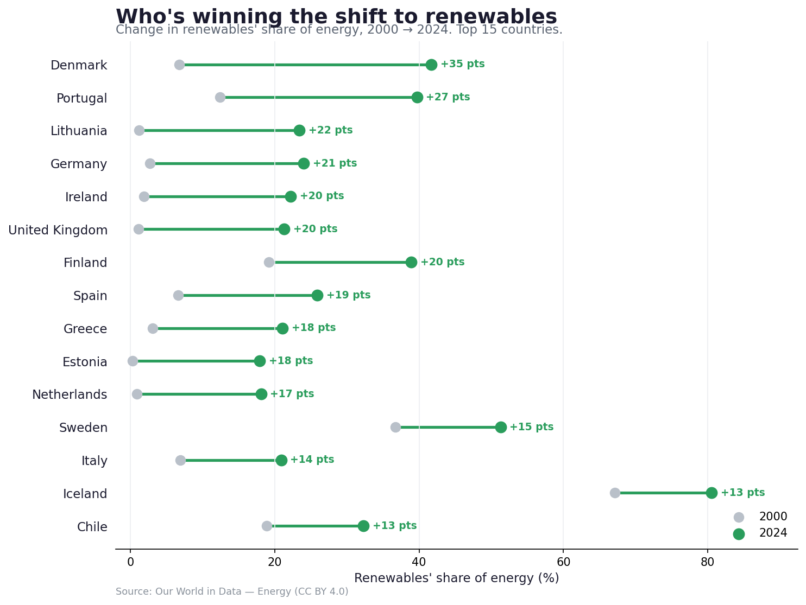
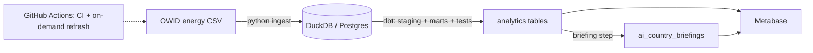

# Global Energy Analytics Pipeline

An end-to-end analytics pipeline on a public dataset: ingest, warehouse, transform
and test with dbt, add a text-enrichment step, and serve it to a Metabase dashboard.
Runs locally on DuckDB with no setup, or on Postgres + Metabase via Docker.

Data is [Our World in Data's energy dataset](https://github.com/owid/energy-data)
(country × year electricity and energy metrics). The main question it answers is
which countries have moved to renewables the fastest since 2000. A dbt model ranks
them; the chart below, the Metabase dashboards, and the per-country briefings all
read from that model.



_This is a matplotlib chart written by `dashboard/hero_chart.py` — not a Metabase
screenshot. It's committed so the result shows on GitHub without running anything.
The interactive Metabase version is described under [Dashboards](#dashboards)._

## Architecture



## Stack

- Python (pandas, SQLAlchemy) for ingestion
- DuckDB for local dev, Postgres for the deployed warehouse
- dbt for modelling and tests
- a briefing step that turns the numbers into text — templated by default, with an
  optional LLM backend (local flan-t5, HF, or Claude) you can switch on
- GitHub Actions for CI and an on-demand refresh
- Metabase for the dashboards

The dbt models are plain SQL and run unchanged on DuckDB, Postgres or BigQuery
(BigQuery is just another target in `profiles.yml`). There's also a Dagster
version of the pipeline in `orchestration/` as a reference; it isn't deployed.

## Run it locally

No Docker needed — everything runs against a local DuckDB file.

```bash
pip install -r requirements.txt

python ingest/load_energy_data.py                 # extract + load
cd dbt && dbt build --profiles-dir . && cd ..     # transform + test
python ingest/ai_enrich.py                        # briefings -> warehouse + markdown
```

Or `make pipeline`. That leaves a `warehouse.duckdb` with the full model graph.

By default the briefing step uses no model — it just formats the numbers. To try
the optional local LLM instead, run with `AI_BACKEND=local` (the first run
downloads a small flan-t5 model, ~250MB, cached after; `LOCAL_MODEL=google/flan-t5-small`
uses less memory).

## Run it with Postgres + Metabase

```bash
docker compose up -d          # Postgres :5432, Metabase :3000
cp .env.example .env
export $(grep -v '^#' .env | xargs)

python ingest/load_energy_data.py
cd dbt && dbt build --profiles-dir . --target prod && cd ..
python ingest/ai_enrich.py
```

Open http://localhost:3000, add the `energy` Postgres database (models are in the
`analytics` schema), and build the dashboard.

Or skip the clicking — `make dashboard` runs all of the above and provisions the
Metabase dashboards automatically via its API. See [`dashboard/README.md`](dashboard/README.md)
for the quick-start.

### Dashboards

`build_dashboard.py` provisions two dashboards through the Metabase API:

- **Global electricity & the shift to renewables** — who's decarbonising fastest
  (the leaderboard), the biggest electricity consumers, renewables share over time,
  and the per-country briefings.
- **Country deep-dive** — pick a country from a dropdown to see its plain-English
  read, its renewables-vs-fossil transition over time, and its leaderboard rank.

## Tests

`dbt build` runs the tests as part of the build (also in CI):

- `not_null` + `unique` surrogate keys at staging and fact grain
- `not_null` + `unique` on `dim_country.iso_code`
- `relationships`: every fact row's `iso_code` exists in `dim_country`

Staging drops OWID's non-country aggregates (World, regions, etc.) by keeping only
rows with a 3-letter ISO code.

## Orchestration

`.github/workflows/scheduled_refresh.yml` re-runs the whole pipeline on demand
(`workflow_dispatch` — the "Run workflow" button in the Actions tab). There's no
cron: the OWID source only publishes a new release roughly once a year, so a
scheduled refresh would almost always be a no-op — you kick it off manually when
upstream actually updates. `ci.yml` runs the pipeline on every push and fails if
any test fails. `orchestration/energy_orchestration/definitions.py` is the same
pipeline expressed as Dagster assets, for reference.

## Briefing step

`ingest/ai_enrich.py` reads the leaderboard and snapshot marts and writes one short
briefing per country back to the warehouse — its rank and how its renewables share
moved since 2000, in a sentence. The numbers come from the dbt model; this just
turns them into text.

It runs on a plain template by default (no model, deterministic — this is what CI
and the committed sample use). The LLM backends are optional; set `AI_BACKEND` to
switch:

- `template` — no model, formats the facts (default)
- `local` — flan-t5 via transformers, offline, no cost
- `hf` — Hugging Face inference API (`HF_TOKEN`)
- `claude` — Anthropic API (`ANTHROPIC_API_KEY`)

## Layout

```
ingest/          load_energy_data.py, ai_enrich.py
dbt/models/      staging/ + marts/ (dim_country, fct_country_energy, 3 marts)
dashboard/       build_dashboard.py (Metabase API), hero_chart.py (PNG)
orchestration/   Dagster reference (not deployed)
.github/         ci + scheduled refresh
docker-compose.yml, requirements.txt, Makefile
```

Data: Our World in Data — Energy, CC BY 4.0.
