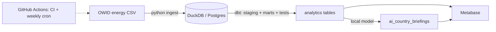

# Global Energy Analytics Pipeline

An end-to-end analytics pipeline on a public dataset: ingest, warehouse, transform
and test with dbt, add a text-enrichment step, and serve it to a Metabase dashboard.
Runs locally on DuckDB with no setup, or on Postgres + Metabase via Docker.

Data is [Our World in Data's energy dataset](https://github.com/owid/energy-data)
(country × year electricity and energy metrics). I picked energy because data
centres are big and growing electricity consumers, so a country's fossil/renewable
mix is a useful lens on the cost and carbon of running infrastructure there.

## Architecture



## Stack

- Python (pandas, SQLAlchemy) for ingestion
- DuckDB for local dev, Postgres for the deployed warehouse
- dbt for modelling and tests
- transformers (local flan-t5) for the enrichment step, swappable to HF or Claude
- GitHub Actions for CI and a scheduled refresh
- Metabase for the dashboard

The dbt models are plain SQL and run unchanged on DuckDB, Postgres or BigQuery
(BigQuery is just another target in `profiles.yml`). There's also a Dagster
version of the pipeline in `orchestration/` as a reference; it isn't deployed.

## Run it locally

No Docker needed — everything runs against a local DuckDB file.

```bash
pip install -r requirements.txt

python ingest/load_energy_data.py                 # extract + load
cd dbt && dbt build --profiles-dir . && cd ..     # transform + test
python ingest/ai_enrich.py                        # briefings -> warehouse + markdown
```

Or `make pipeline`. That leaves a `warehouse.duckdb` with the full model graph.

The first `ai_enrich.py` run downloads a small flan-t5 model (~250MB, cached
after). Set `LOCAL_MODEL=google/flan-t5-small` for less memory, or
`AI_BACKEND=template` to skip the model entirely.

## Run it with Postgres + Metabase

```bash
docker compose up -d          # Postgres :5432, Metabase :3000
cp .env.example .env
export $(grep -v '^#' .env | xargs)

python ingest/load_energy_data.py
cd dbt && dbt build --profiles-dir . --target prod && cd ..
python ingest/ai_enrich.py
```

Open http://localhost:3000, add the `energy` Postgres database (models are in the
`analytics` schema), and build the dashboard.

### Dashboard tiles

- Top electricity consumers — bar, `mart_latest_snapshot`, country × `electricity_demand_twh`, top 10
- Renewables share over time — line, `mart_renewables_transition`, `year` × `renewables_share_pct`, a few countries
- Renewables vs emissions — scatter, `mart_latest_snapshot`, `renewables_share_pct` × `electricity_emissions_mtco2e`, size = demand
- Briefings — table, `ai_country_briefings`, country + briefing

## Tests

`dbt build` runs the tests as part of the build (also in CI):

- `not_null` + `unique` surrogate keys at staging and fact grain
- `not_null` + `unique` on `dim_country.iso_code`
- `relationships`: every fact row's `iso_code` exists in `dim_country`

Staging drops OWID's non-country aggregates (World, regions, etc.) by keeping only
rows with a 3-letter ISO code.

## Orchestration

`.github/workflows/scheduled_refresh.yml` re-runs the pipeline every Monday on the
free tier. `ci.yml` runs it on every push and fails if any test fails.
`orchestration/energy_orchestration/definitions.py` is the same pipeline expressed
as Dagster assets, for reference.

## Enrichment backends

`ingest/ai_enrich.py` reads the marts, writes a short briefing per country back
into the warehouse. `AI_BACKEND`:

- `local` — flan-t5 via transformers, offline, no cost (default)
- `hf` — Hugging Face inference API (`HF_TOKEN`)
- `claude` — Anthropic API (`ANTHROPIC_API_KEY`)
- `template` — no model, formats the facts; used in CI and for the committed sample

## Layout

```
ingest/          load_energy_data.py, ai_enrich.py
dbt/models/      staging/ + marts/ (dim_country, fct_country_energy, 2 marts)
orchestration/   Dagster reference (not deployed)
.github/         ci + scheduled refresh
docker-compose.yml, requirements.txt, Makefile
```

Data: Our World in Data — Energy, CC BY 4.0.
